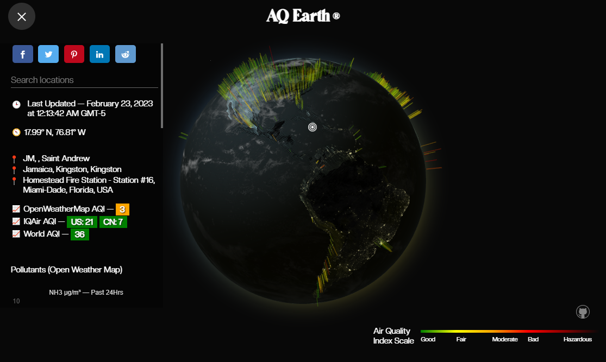

# AQ Earth

[](https://app.netlify.com/sites/aqearth/deploys)

AQ Earth is a real-time data visualization of the world's air quality plotted onto a 3D globe. The user can click on a random location to get more detailed information around that coordinate. Data is fetched from three different APIs: Open Weather Maps, IQ Air & World AQI.

## Tech

- Three JS
- GSAP
- GLSL
- Express JS
- TypeScript
- Chart JS

## Env

```
OPEN_WEATHER_API=""
WAQI_API=""
IQ_AIR_API=""
```

## Start

`npm run serve`

## Preview

